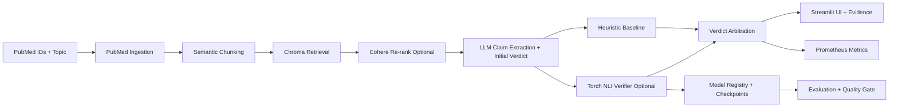

# 🔎 Biomedical Contradiction Detector

This project is an AI-powered agent designed to tackle a critical challenge for researchers: identifying contradictory claims in scientific literature. It uses a robust, evidence-grounded Retrieval-Augmented Generation (RAG) pipeline to analyze and compare any two papers from PubMed.

This repository is the result of a rigorous development process that went far beyond a simple tutorial. It involved iterative debugging of a complex software stack, hardening the system against inconsistent real-world data, and refactoring the core logic to meet production-grade standards.

---

## 🚀 Live Demo


---

## The Problem

The volume of biomedical research is staggering. For any given topic, there are often dozens of studies with conflicting findings. Manually tracking these is a massive bottleneck. This tool was built to automate the first-pass analysis, using an AI agent to flag potential contradictions and, crucially, to show the exact evidence for its reasoning.

## My Approach: A Production-Minded RAG System

I designed this project to be a robust prototype, focusing on engineering decisions that a senior developer would make.

*   **Evidence-Grounded Reasoning:** The core principle is that the LLM's final verdict **must** be based on retrieved text, not its own internal knowledge. The final version of this app implements a true RAG pipeline where only the most relevant, re-ranked passages from each paper are sent to the LLM for analysis.

*   **Building for Real-World Data:** The initial PubMed data fetching was fragile. I re-engineered it to be resilient to PubMed's varied XML schemas and to gracefully handle entries with missing abstracts—a common real-world data problem.

*   **A Dynamic "Just-in-Time" Database:** The application doesn't require a pre-populated database. When a user enters new PubMed IDs, the system automatically fetches the abstracts, performs semantic chunking, and ingests them into the local ChromaDB vector store on the fly.

*   **High-Fidelity Retrieval:** A simple vector search is not enough. This pipeline uses a two-stage process for accuracy:
    1.  **Semantic Chunking & Candidate Retrieval:** Abstracts are split into contextually-aware chunks and retrieved from **ChromaDB**.
    2.  **High-Relevance Re-ranking:** **Cohere's** powerful re-ranker is used to ensure only the most relevant passages are passed to the agent, filtering out noise.

*   **Trust and Transparency in the UI:** The Streamlit UI was designed to build user trust. It doesn't just show a verdict; it includes expandable sections that display the **exact evidence passages** the agent used for its analysis, making the reasoning process transparent.

## Architecture



## Evaluation Snapshot

Latest reproducible harness run (`make eval-report`, 2026-02-17 UTC):

- Retrieval baseline on SciFact claims:
  - `Recall@1 = 0.3989`
  - `Recall@10 = 0.6064`
  - `MRR@10 = 0.4679`
- Verdict metrics on SciFact dev pairs (`n=638`):
  - `majority_unrelated macro_f1 = 0.2132`
  - `heuristic macro_f1 = 0.4925`
  - `torch_verifier macro_f1 = 0.2452`
- Quality gate (`macro_f1 >= 0.70` and `delta_over_heuristic >= 0.10`):
  - current status: `fail` (expected at this training stage)
  - this is intentional and acts as a regression barrier in strict mode

## Key Learnings from Development

*   **The Importance of a Stateless Architecture:** Early versions of the Streamlit app suffered from "zombie" database connections due to a conflict between caching and file deletion. I re-architected the app to be stateless on startup, guaranteeing a clean, predictable database state for every session.
*   **Data Curation is King:** The biggest challenge was not the code, but the data. My AI mentor repeatedly provided faulty PubMed IDs. The robustness of the final application was proven by its ability to correctly analyze this "garbage" data and return a logical "Unrelated" verdict every time. This led me to build my own `verify_papers.py` script for data curation.

## Technical Stack

*   **LLM & Agent Logic:** OpenAI / Gemini / Local deterministic baseline (JSON-structured outputs)
*   **Classical Baseline:** Heuristic contradiction verifier (lexical overlap + polarity) for ablations
*   **Retrieval:** ChromaDB, Cohere Re-ranker
*   **Text Processing:** LangChain (for Semantic Chunking)
*   **Data Ingestion:** PubMed API
*   **Frontend:** Streamlit

## Running the App Locally

1.  **Clone the repository:**
    ```bash
    git clone https://github.com/RomanceLIVE/RAG_Contradiction_Detector.git
    cd RAG_Contradiction_Detector
    ```
2.  **Set up the environment:**
    ```bash
    python -m venv venv
    source venv/bin/activate  # On Windows: venv\Scripts\activate
    pip install -r requirements.txt
    ```
3.  **Add API Keys:**
    *   Start from the template:
      ```bash
      cp .env.example .env
      ```
    *   Then update `.env` with your keys:
      ```
      OPENAI_API_KEY="sk-..."
      COHERE_API_KEY="..."
      GEMINI_API_KEY="..."  # optional if LLM_PROVIDER="gemini"
      LLM_PROVIDER="openai" # one of: openai, gemini, local
      VERIFIER_BACKEND="heuristic" # heuristic or torch
      VERIFIER_STRATEGY="confidence_override" # llm_only, confidence_override, verifier_only
      VERIFIER_OVERRIDE_CONFIDENCE="0.65"
      TORCH_VERIFIER_CHECKPOINT="" # optional explicit .pt path
      MODEL_REGISTRY_LATEST_PATH="artifacts/model_registry_latest.json"
      METRICS_ENABLED="1"
      METRICS_HOST="0.0.0.0"
      METRICS_PORT="9108"
      ```
    *   If you choose Gemini provider, install support once:
      ```bash
      pip install google-generativeai
      ```
4.  **Run the application:**
    ```bash
    python -m streamlit run app.py
    ```

## Developer Workflow (Step-by-Step)

This repo now includes lightweight reproducibility scaffolding for evaluation and local checks.

1. **Create and activate environment (uv):**
   ```bash
   uv venv venv --python 3.10
   source venv/bin/activate
   uv pip install -r requirements.txt
   ```
   If torch install is slow on first run, this is expected (large wheel).
2. **Run app:**
   ```bash
   make app
   ```
3. **Run unit tests:**
   ```bash
   make test
   ```
4. **Run a no-network smoke test (local baseline):**
   ```bash
   make smoke-local
   ```
5. **Run trainable verifier smoke test (requires torch):**
   ```bash
   make smoke-torch
   ```
6. **Generate a bootstrap evaluation report:**
   ```bash
   make bootstrap-eval
   ```
7. **Prepare SciFact training pairs (real dataset):**
   ```bash
   make prep-scifact
   ```
8. **Train torch verifier (quick smoke run):**
   ```bash
   make train-verifier-quick
   ```
9. **Run full evaluation harness (retrieval + verdict metrics):**
   ```bash
   make eval-report
   ```
10. **Run gate check (strict in CI, soft locally):**
   ```bash
   make quality-gate-soft   # local diagnostic mode
   # make quality-gate      # strict mode (fails if gate is fail/pending)
   ```
11. **Train torch verifier (full CPU run):**
   ```bash
   make train-verifier
   ```
12. **Inspect model registry entries:**
   ```bash
   make show-model-registry
   ```
13. **Run CI-equivalent local checks:**
   ```bash
   make ci
   ```
14. **Prepare minikube deployment assets:**
   ```bash
   make minikube-build-image
   make minikube-secret-from-env
   make minikube-deploy
   make minikube-status
   ```

Generated files:
- `reports/eval_report.bootstrap.json`
- `reports/eval_report.json`
- `reports/eval_report.md`
- `artifacts/` for future model/eval outputs
- `data/scifact/processed/train_pairs.jsonl`
- `data/scifact/processed/dev_pairs.jsonl`
- `artifacts/torch_verifier*/train_report.json`
- `artifacts/model_registry.jsonl`
- `artifacts/model_registry_latest.json`

### Trainable Verifier Notes
- `scripts/prepare_scifact_pairs.py` creates claim-evidence NLI pairs from SciFact:
  - `SUPPORT -> Supporting`
  - `CONTRADICT -> Contradictory`
  - sampled non-evidence docs -> `Unrelated`
- `scripts/train_torch_verifier.py` trains a small PyTorch NLI model and saves:
  - `artifacts/torch_verifier*/torch_nli_verifier.pt`
  - `artifacts/torch_verifier*/train_report.json`
  - registry metadata entry in `artifacts/model_registry.jsonl`

### Model Version Tracking
- Every training run appends one line to `artifacts/model_registry.jsonl`.
- Each registry entry captures:
  - run ID and UTC timestamp
  - checkpoint path + SHA256 hash
  - dev metrics (`macro_f1`, `accuracy`, `loss`)
  - dataset paths/sample counts and hyperparameters
  - git commit/branch/dirty-state snapshot

### Evaluation Harness (Reproducible)
- Script: `scripts/evaluate_rag_stack.py`
- Produces:
  - `reports/eval_report.json` (machine-readable)
  - `reports/eval_report.md` (human summary)
- Metrics included:
  - retrieval: `Recall@k`, `MRR@k` on SciFact claim-to-document lexical retrieval baseline
  - verdict: `accuracy`, `macro_f1`, `contradiction_f1` for:
    - `majority_unrelated`
    - `heuristic` baseline
    - `torch_verifier` (if checkpoint is available)
- Quality gate:
  - `macro_f1 >= 0.70`
  - `delta_over_heuristic >= 0.10`
  - gate status reported as `pass` / `fail` / `pending`

### Quality Gate Enforcement
- Script: `scripts/check_quality_gate.py`
- Reads an evaluation report JSON (`--report ...`) and enforces gate status:
  - strict mode (default): exits non-zero unless status is `pass`
  - soft mode: allows non-pass statuses for local diagnostics
- Make targets:
  - `make quality-gate` (strict; CI-friendly)
  - `make quality-gate-soft` (local iteration)
- Gate targets evaluate into `artifacts/eval_gate_report.json` / `artifacts/eval_gate_report.md` so routine checks do not churn tracked report files.

### CI/CD (GitHub Actions)
- Workflow: `.github/workflows/ci.yml`
- Runs on push/PR:
  - `make lint` (compile-based lint)
  - `pytest` unit tests
  - `make smoke-local` no-network smoke
  - Docker image build (`docker build -t rag-contradiction-detector:ci .`)
- This gives a concrete gate before deployment and demonstrates reproducible packaging.

### Live Verdict Arbitration (LLM + Verifier)
- The app keeps the LLM as first-pass reasoning, then optionally runs a trained Torch verifier on the extracted claims.
- Arbitration policies:
  - `llm_only`: always trust LLM verdict.
  - `confidence_override`: use verifier verdict only when it disagrees and confidence is above threshold.
  - `verifier_only`: always trust verifier when available.
- UI now shows:
  - final verdict
  - original LLM verdict
  - verdict source (`llm` or `torch_verifier`)
  - arbitration reason

### Observability (Prometheus-Compatible)
- The app exports runtime metrics on a dedicated endpoint:
  - `http://localhost:9108/metrics` (when `METRICS_ENABLED=1`)
- Instrumented metrics include:
  - `rag_pipeline_requests_total` by provider/verdict/source
  - `rag_pipeline_errors_total` by provider/error type
  - `rag_pipeline_duration_seconds`
  - retrieved chunk count distribution
  - verifier disagreement/override counters
- Quick local check:
  ```bash
  curl -s http://localhost:9108/metrics | head -n 40
  ```

## Docker Workflow (Recommended)

Using Docker avoids local Python/package drift and makes onboarding much faster.

### CPU (default, safest)
```bash
make docker-build-cpu
make docker-up-cpu
```
Open: `http://localhost:8501`
Metrics: `http://localhost:9108/metrics`

### GPU (optional, faster torch workloads)
Prerequisites:
- NVIDIA GPU
- NVIDIA drivers
- Docker Desktop / Docker Engine with NVIDIA container runtime enabled

Run:
```bash
make docker-build-gpu
make docker-up-gpu
```
Open: `http://localhost:8502`
Metrics: `http://localhost:9109/metrics`

### Auto mode (GPU if available, otherwise CPU)
```bash
make docker-up-auto
```

Notes:
- GPU profile uses a CUDA-enabled torch wheel (`cu121`).
- CPU profile uses CPU-only torch wheels.
- In both modes, code still checks `torch.cuda.is_available()`, so CPU fallback remains safe.
- Device selection can be overridden with `TORCH_DEVICE`:
  - `TORCH_DEVICE=auto` (default)
  - `TORCH_DEVICE=cuda` (fallbacks to CPU if unavailable)
  - `TORCH_DEVICE=cpu`

## Kubernetes (Minikube)

Manifests are in `k8s/`:
- `k8s/deployment.yaml` (Deployment with readiness/liveness probes)
- `k8s/service.yaml` (NodePort Service for app + metrics)
- `k8s/configmap.yaml` (non-secret runtime config)
- `k8s/secret.example.yaml` (secret template, do not commit real keys)

Default Kubernetes runtime uses `VERIFIER_BACKEND=heuristic` to avoid boot warnings when no model artifacts are bundled into the image.
To enable Torch verifier in Kubernetes, provide checkpoint artifacts inside the container image or a mounted volume and set:
- `VERIFIER_BACKEND=torch`
- `MODEL_REGISTRY_LATEST_PATH` to a valid in-container registry snapshot path

### Deploy to Minikube
1. Start minikube:
   ```bash
   minikube start
   ```
2. Build image in minikube runtime:
   ```bash
   make minikube-build-image
   ```
3. Create/update Kubernetes secret from local `.env`:
   ```bash
   make minikube-secret-from-env
   ```
   This target only injects API keys and parses quoted `.env` values correctly.
4. Apply manifests:
   ```bash
   make minikube-deploy
   make minikube-status
   ```
5. Access app and metrics:
   ```bash
   minikube service -n rag-contradiction rag-detector --url
   ```
   The service exposes:
   - Streamlit app on port `8501`
   - Prometheus metrics on port `9108`

## Why Docker + Minikube

- Docker solves your immediate pain: environment/package consistency.
- Minikube is best used once we package an inference API deployment shape (Deployment/Service/ConfigMap/Secret and metrics endpoint).
- We will add minikube manifests after the training + evaluation + API layer is stable, so Kubernetes config reflects real production behavior instead of placeholders.

## Responsible AI Controls

- Evidence-grounded prompting: model is instructed to use retrieved passages only.
- Transparent outputs: claims, evidence snippets, baseline verdict, arbitration reason are shown to users.
- Fallback behavior: if verifier artifact is missing or confidence is below threshold, pipeline keeps conservative LLM verdict flow.
- Regression checks: strict quality gate blocks promotion when target metrics are not met.

## Limitations

- Current ingestion focuses on abstracts, not full-text PDFs.
- SciFact does not perfectly match every biomedical contradiction pattern in PubMed.
- Torch verifier quality is currently below production threshold and needs further training/data curation.
- Streamlit-first app architecture is ideal for demos, but API-first service split is preferable for large-scale serving.

## Roadmap

1. Improve verifier performance with better class balancing and hard-negative mining.
2. Add curated PubMed contradiction gold set and weekly regression evaluations.
3. Add API service split (`FastAPI`) for cleaner serving + autoscaling patterns.
4. Add Prometheus + Grafana dashboard bundle and alert rules.
5. Expand ingestion to full-text documents with explicit provenance tracing.

## Interview Talk Track

1. Problem framing: researchers face contradictory biomedical findings and need evidence-grounded triage.
2. Core design decision: combine RAG extraction with explicit verifier arbitration instead of prompt-only verdicts.
3. ML rigor: ship baseline + trainable model + reproducible evaluation + hard quality gate.
4. MLOps shape: Dockerized runtime, GitHub Actions CI, minikube manifests, health checks, Prometheus metrics.
5. Engineering tradeoff: default Kubernetes verifier is heuristic unless model artifacts are mounted, to keep runtime reliable.
6. Honest status: retrieval and baseline are strong; verifier still needs quality improvements, and the gate correctly blocks release.
